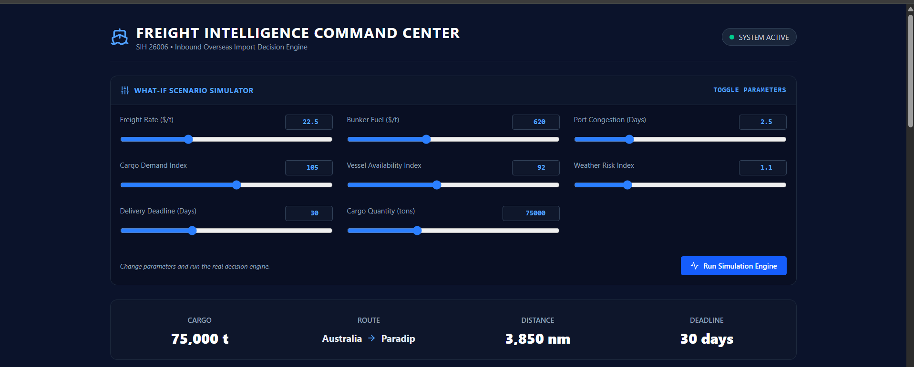
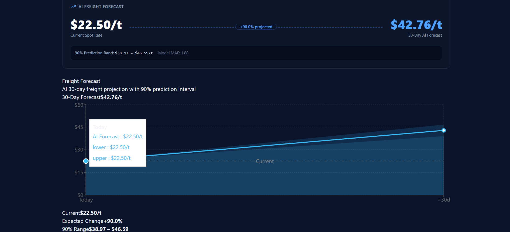
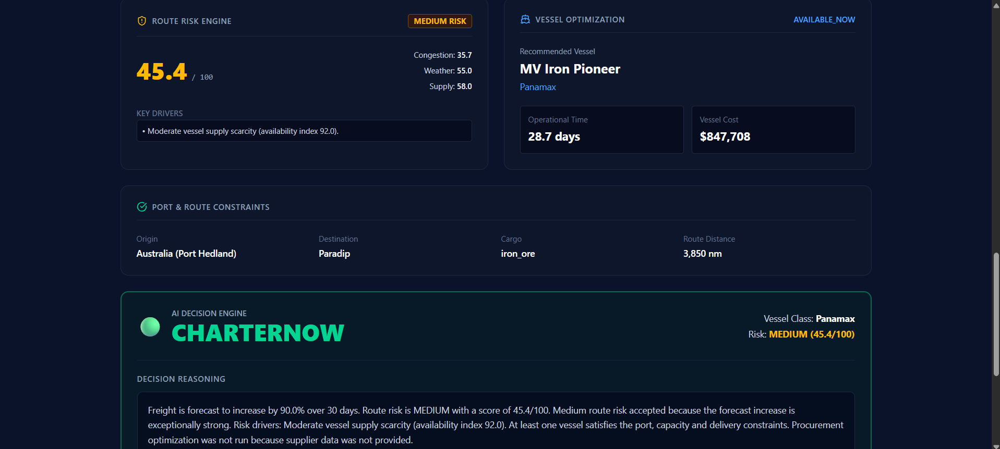

AI-Driven Maritime Freight Intelligence & Route Optimization System

STATEMENT:
Development of an Intelligent Freight Forecasting Model for Optimized Vessel Chartering and Bulk Cargo Procurement from Overseas to the East Coast of India.

Overview

The AI-Driven Maritime Freight Intelligence & Route Optimization System is an AI-powered decision-support platform for maritime chartering and bulk-cargo procurement.

Instead of looking only at the current freight rate, the system combines historical freight behavior, bunker fuel prices, cargo demand, vessel availability, port congestion, seasonality, operational risk, port/vessel constraints, procurement constraints, and financial exposure.

The final output is an explainable:

CHARTER NOW / WATCH / WAIT

recommendation.

Problem

Maritime freight chartering can be highly reactive. Freight rates are affected by cargo demand, vessel supply, fuel prices, port congestion, seasonality, commodity conditions, and operational constraints.

A freight forecast alone is not enough. Even when freight is expected to rise, an available vessel may fail draft, beam, capacity, port-compatibility, or delivery-deadline requirements.

## 1. Freight Intelligence Command Center

The Freight Intelligence Command Center provides a unified interface for
evaluating an overseas bulk-cargo chartering scenario.

The What-If Scenario Simulator allows decision-makers to modify key
operational and market parameters, including:

- Freight rate
- Bunker fuel price
- Port congestion
- Cargo demand
- Vessel availability
- Weather risk
- Delivery deadline
- Cargo quantity

The selected scenario in this demonstration represents a 75,000-ton
iron-ore shipment from Australia (Port Hedland) to Paradip, covering
approximately 3,850 nautical miles with a 30-day delivery deadline.

## 2. AI Freight Forecast

The AI Freight Forecast module estimates the freight rate at the 30-day
forecast horizon using the trained machine learning model.

For this scenario, the current spot freight rate is **$22.50/t**, while the
30-day AI forecast is **$42.76/t**, representing an expected increase of
**90.0%**.

The system also provides an empirical **90% prediction interval of
$38.97–$46.59/t**, allowing decision-makers to understand the uncertainty
around the forecast. The displayed **Model MAE of 1.88** represents the
model's mean absolute error from chronological holdout evaluation.

For the demonstrated scenario, the current freight rate is **$22.50/t**,
while the 30-day forecast is **$42.76/t**, representing an expected
increase of **90.0%**.

The shaded region represents the model's empirical **90% prediction
interval**, ranging from **$38.97/t to $46.59/t** at the forecast horizon.
This provides decision-makers with an indication of forecast uncertainty
rather than relying only on a single predicted value.

## 3. Route Risk Engine

The Route Risk Engine evaluates operational risk using congestion, weather,
vessel supply, and route distance.

The demonstrated scenario produces a Medium Risk score of 45.4/100.

---

## 4. Vessel Optimization

The Vessel Optimization module evaluates vessel capacity, port constraints,
availability, and delivery deadline before selecting a feasible vessel.

For the demonstrated scenario, MV Iron Pioneer (Panamax) is selected with
an operational time of 28.7 days against a 30-day deadline.

---

## 5. Financial Scenario Analysis

The Financial Scenario Analysis module estimates the freight expenditure
under two scenarios: booking at the current rate and waiting for the
30-day forecast.

For the demonstrated scenario:

- Book Now: ₹14.01 Cr
- Wait 30 Days: ₹26.62 Cr
- Exposure Delta: ₹12.61 Cr

---

## 6. AI Decision Engine

The Decision Engine combines freight forecasting, operational risk,
vessel feasibility, and financial exposure to produce an actionable
chartering recommendation.

For the demonstrated scenario, the system recommends **CHARTER NOW**.

This project therefore connects:

DATA → FORECAST → RISK → CONSTRAINTS → OPTIMIZATION → FINANCIAL EXPOSURE → DECISION

Core Questions

Should we charter now or wait?

What freight rate can we expect over the next 30 observations/days?

Which vessel is operationally feasible and cost-effective?

What operational risks exist?

How does waiting change financial exposure?

Key Features

Freight Forecasting

The forecasting pipeline uses:

Freight rate

Bunker fuel price

Cargo demand index

Vessel availability index

Port congestion days

Rate lags: 1, 7 and 14

7-day and 14-day rolling means

7-day volatility

Demand/vessel ratio

Fuel-price lag

Cyclical month features

The model returns a predicted freight rate, movement/trend, a 90% empirical uncertainty interval, and model/baseline metrics.

Model Benchmark

Models were evaluated using a chronological holdout rather than a random split.

Model

MAE

RMSE

Naive Persistence Baseline

2.3455

2.9784

Linear Regression

1.9079

2.4126

Random Forest Regressor

1.8802

2.3068

XGBoost Regressor

1.9756

2.4263

Champion model: Random Forest Regressor

Compared with the naive baseline:

MAE improvement: 19.84%

RMSE improvement: 22.55%

Random Forest was selected because it achieved the lowest error on the available structured dataset while capturing nonlinear relationships among freight, fuel, demand, vessel supply, congestion, lagged rates and seasonality.

Risk Assessment

The risk engine combines:

Port congestion

Weather risk

Vessel supply scarcity

Distance complexity

It returns a risk score, risk level, key drivers and sub-scores.

Score

Level

0–39.99

LOW

40–69.99

MEDIUM

70–100

HIGH

Port and Vessel Constraints

Candidate vessels are checked against cargo requirements, vessel capacity, draft, beam, destination-port compatibility, availability and delivery deadline.

Infeasible vessels are rejected with reasons before the final recommendation.

Vessel Optimization

The vessel solver selects a feasible vessel using operational constraints including:

Cargo quantity

Vessel capacity

Draft

Beam

Port compatibility

Availability/ETA

Delivery deadline

Operational duration

Cost

Procurement Optimization

The procurement solver allocates cargo across suppliers subject to:

Supplier capacity

Minimum order quantity

Maximum allocation percentage

Freight/landed cost

Required quantity

The current implementation uses SciPy HiGHS linear programming.

Financial Exposure

The decision engine compares:

Book Now = cargo quantity × current freight rate

with:

Wait = cargo quantity × forecast freight rate

The resulting exposure is also presented in INR for the dashboard.

Decision Engine

The complete workflow is:

Freight Forecast
      +
Risk Assessment
      +
Port Constraints
      +
Vessel Optimization
      +
Procurement Optimization
      +
Financial Exposure
      ↓
Freight Decision Engine
      ↓
CHARTER NOW / WATCH / WAIT

A strong forecast does not automatically mean a charter is feasible. If freight is expected to rise sharply but no vessel satisfies the operational constraints, the system can return WATCH — CHARTER BLOCKED and explain why.

Architecture

Historical / Scenario Data
          ↓
Data Validation
          ↓
Feature Engineering
          ↓
 ┌────────┴─────────┐
 ↓                  ↓
Forecasting       Risk Engine
(Random Forest)     ↓
 └────────┬─────────┘
          ↓
Port & Vessel Constraints
          ↓
Vessel Optimization
          ↓
Procurement Optimization
          ↓
Financial Exposure
          ↓
Decision Engine
          ↓
 CHARTER NOW / WATCH / WAIT

Data Pipeline

PostgreSQL
    ↓
SQLAlchemy ORM
    ↓
FreightRate model
    ↓
Pandas DataFrame
    ↓
Feature Engineering
    ↓
Processed CSV
    ↓
ML Training / Evaluation
    ↓
Random Forest Model

The pipeline performs date conversion, chronological sorting, target generation, lag features, rolling statistics, domain ratios, cyclical seasonality encoding, missing-value removal, and CSV generation.

Implementation note: the current target uses shift(-30), meaning 30 observations/rows. This corresponds approximately to 30 days when the underlying observations are daily and regular.

Data Strategy

The system is designed around the SIH problem-statement data categories:

Historical freight rates

Bunker fuel prices

Cargo demand

Vessel availability

Port congestion

Seasonality

Commodity/operational indicators

The prototype distinguishes historical/model-development data from controlled synthetic or scenario data used for What-If testing.

Synthetic scenario inputs are used for simulation and stress-testing and are not presented as real-time market observations.

A production system can integrate verified freight-market, port, AIS/vessel-tracking, fuel-price, commodity, weather and congestion feeds.

ML Workflow

Historical Freight Data
        ↓
Data Validation
        ↓
Feature Engineering
        ↓
Chronological Train/Test Split
        ↓
Naive / Linear / Random Forest / XGBoost
        ↓
MAE + RMSE Evaluation
        ↓
Random Forest Selected
        ↓
forecaster_model.pkl
        ↓
Runtime Prediction

The trained model is stored in:

models/forecaster_model.pkl

The runtime loads the serialized Random Forest model and predicts using the expected feature order.

Forecast Uncertainty

The system reports a 90% empirical uncertainty interval based on holdout prediction residuals. It is an uncertainty estimate, not a guarantee of future market prices.

API

Method

Endpoint

Purpose

POST

/api/v1/decision/evaluate

Complete decision engine

POST

/api/v1/forecast/predict

Freight forecast

POST

/api/v1/risk/evaluate

Risk evaluation

POST

/api/v1/optimize/vessels

Vessel optimization

POST

/api/v1/optimize/procurement

Procurement optimization

GET

/api/v1/routes

Route information

GET

/api/v1/vessels

Vessel information

FastAPI interactive documentation is available at /docs.

Project Structure

freight-intelligence-system/
├── backend/
│   ├── app/
│   │   ├── api/v1/endpoints/
│   │   │   ├── decision.py
│   │   │   ├── forecast.py
│   │   │   ├── optimization.py
│   │   │   ├── risk.py
│   │   │   ├── routes.py
│   │   │   └── vessels.py
│   │   ├── core/config.py
│   │   ├── data/vessel_fleet.json
│   │   ├── database/
│   │   │   ├── base.py
│   │   │   └── session.py
│   │   ├── ml/
│   │   │   ├── explainability.py
│   │   │   ├── predict_forecaster.py
│   │   │   ├── risk_engine.py
│   │   │   └── train_forecaster.py
│   │   ├── models/
│   │   │   ├── decision.py
│   │   │   ├── freight_rate.py
│   │   │   ├── route.py
│   │   │   └── vessel.py
│   │   ├── optimization/
│   │   │   ├── port_constraints.py
│   │   │   ├── procurement_solver.py
│   │   │   └── vessel_solver.py
│   │   ├── schemas/
│   │   ├── services/decision_engine.py
│   │   └── main.py
│   ├── .env.example
│   └── requirements.txt
├── data/
│   ├── processed/freight_features_processed.csv
│   └── raw/historical_freight_raw.csv
├── frontend/
│   ├── public/
│   └── src/
│       ├── assets/
│       ├── components/
│       │   ├── charts/FreightForecastChart.jsx
│       │   └── common/
│       │       ├── KPICard.jsx
│       │       ├── Navbar.jsx
│       │       └── RiskBadge.jsx
│       ├── pages/CommandCenter.jsx
│       ├── services/api.js
│       ├── App.css
│       ├── App.jsx
│       ├── index.css
│       └── main.jsx
├── models/
│   ├── forecaster_model.pkl
│   └── forecaster_scaler.pkl
├── scripts/
│   ├── evaluate_models.py
│   ├── generate_synthetic_data.py
│   ├── seed_database.py
│   ├── train_model.py
│   └── validate_data.py
└── .gitignore

##Technology Stack

Backend

Python

FastAPI

PostgreSQL

SQLAlchemy

Pandas

NumPy

scikit-learn

XGBoost

joblib

SciPy HiGHS

Frontend

React

Vite

JavaScript

Axios

Tailwind CSS

Deployment

Render

Vercel

Git / GitHub

Local Setup

Clone

git clone https://github.com/DEEPIKASINGH608/freight-intelligence-system.git
cd freight-intelligence-system

Backend

python -m venv venv
venv\Scripts\Activate.ps1
cd backend
pip install -r requirements.txt
uvicorn app.main:app --reload (or python -m uvicorn app.main:app --reload)

Backend:

http://localhost:8000

Docs:

http://localhost:8000/docs

Frontend

Open another terminal:

cd frontend
npm install
npm run dev

Configure:

VITE_API_BASE_URL=http://localhost:8000/api/v1

Deployment

Backend — Render

Root Directory: backend
Build: pip install -r requirements.txt
Start: uvicorn app.main:app --host 0.0.0.0 --port $PORT

Frontend — Vercel

Root Directory: frontend
Install: npm install
Build: npm run build
Output: dist

Production API variable:

VITE_API_BASE_URL=https://freight-intelligence-backend.onrender.com/api/v1

If this Vite environment variable changes, the frontend must be rebuilt/redeployed.

Example What-If Scenario

A representative scenario can contain:

Cargo:             95,000 tons
Route:              Australia / Port Hedland → Paradip
Deadline:           40 days
Current Freight:    $25.00/ton
Forecast Freight:   $41.96/ton
Movement:           +67.8%
Risk:               MEDIUM
Risk Score:         64.9
Selected Vessel:    MV Eastern Trader
Vessel Type:        Capesize
Operational Time:   ~32.3 days
Decision:           CHARTER NOW

The exact result depends on the submitted scenario inputs.

Why This System Is Different

The project does not attempt to replace chartering experts. It aims to make their decisions faster, more systematic, data-driven, constraint-aware, scenario-based and explainable.

The key difference is that the system does not stop at forecasting:

Forecast
   ↓
Risk
   ↓
Feasibility
   ↓
Optimization
   ↓
Financial Exposure
   ↓
Decision

It therefore behaves as a maritime freight decision-support system, rather than only a prediction model or visualization dashboard.

Limitations

Some What-If inputs are synthetic or controlled simulation data.

The prototype does not claim access to proprietary chartering-market data.

The current dataset is smaller than the data volume available to commercial platforms.

The current target uses 30 observations rather than explicitly enforcing 30 calendar days.

Production use requires verified live market, port, vessel, fuel, weather and commodity feeds.

Model performance can change when market regimes change.

The 90% interval is an empirical uncertainty estimate, not a guarantee.

Future Scope

Live freight-market feeds

AIS/vessel tracking

Real-time port congestion

Live bunker fuel prices

Weather and marine-condition feeds

Commodity indicators

More historical routes and origins

Automated retraining and model monitoring

Model-drift detection

Probabilistic forecasting

Advanced temporal models with larger datasets

Multi-voyage charter planning

Short/medium-term contract optimization

Advanced procurement planning

Production-grade authentication and role-based access

Automated alerts

These are future extensions, not claims about the current prototype.

Security

Never commit secrets.

Keep these local:

backend/.env
frontend/.env

Commit only the templates:

backend/.env.example
frontend/.env.example

Recommended .gitignore:

venv/
__pycache__/
*.pyc
.env

Project Philosophy

Don't just predict the freight rate. Turn the prediction into an operational decision.

The system moves from:

DATA → FORECAST → RISK → CONSTRAINTS → OPTIMIZATION → FINANCIAL EXPOSURE → DECISION

Domain: Transportation & Logistics / Supply Chain
Category: Software